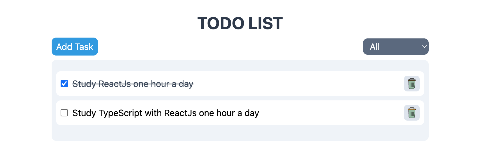

# My To-Do List App

Welcome to My To-Do List App, a task management application designed to help you stay organized and productive!

## Introduction

My To-Do List App is a personal project that I created to enhance my app development skills using React and state management with `useState`. This application is perfect for organizing your daily tasks. With the added touch of TypeScript and Tailwind CSS, the app boasts a sleek and modern user interface.

## Getting Started

To run the app locally, follow these steps:

1. Make sure you have Node.js installed on your computer.
2. Download or clone the My To-Do List App repository to your local machine.
3. Open your preferred terminal and navigate to the project folder.
4. Install all the required dependencies by running the command `npm install`.
5. Start the development server with the command `npm run dev`.

The application will then be accessible locally at `http://localhost:5173/`.

## Embracing Modern Technologies

My To-Do List App embraces the power of modern technologies, including:

- React: The popular JavaScript library for creating dynamic and efficient user interfaces.
- TypeScript: A superset of JavaScript that provides a static type system for better productivity and code stability.
- Tailwind CSS: A utility-first CSS framework that helps create responsive and stylish designs with ease.

Join us at My To-Do List App and start managing your tasks with elegance and efficiency!
